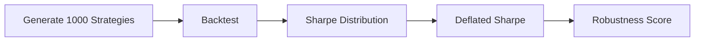

# Backtest Overfitting Detector

Detect whether an impressive Sharpe ratio is real or statistical luck.

## Goal
Implement Deflated Sharpe Ratio, Probability of Backtest Overfitting and Monte Carlo validation.

## Workflow

## Metrics
- Sharpe
- Deflated Sharpe
- Skew
- Kurtosis
- PBO

## UI
- Histogram
- DSR meter
- Robustness report
- Monte Carlo simulator

## Outcome
Only statistically significant strategies pass.
